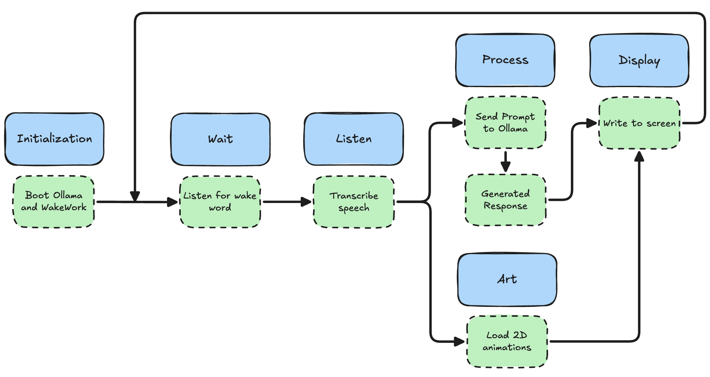

# Retro PC AI Assistant

## An AI assistant built for the NVIDIA Jetson Orin Nano using an Ollama model.

A retro-inspired, fully on-device AI voice assistant built on the NVIDIA Jetson Orin Nano. Housed in a wood-textured 3D-printed enclosure, it listens for one of the following wake words:

* "Alexa"
* "Hey Mycroft"
* "Hey Jarvis"
* "Hey Rhasspy"
* "What's the weather"
* "Set a 10 minute timer"

Afterwards, it processes your vocal query locally using a small language model to convert the speech to text. The text is passed to llama3.2:3b model to develop a reply. Finally the response is displayed on the screen before returning to an idle animation. 

## Model System Architecture

<picture>
  <source media="(prefers-color-scheme: dark)" srcset="assets/architectureDark.png">
  <source media="(prefers-color-scheme: light)" srcset="assets/architectureLight.png">
  
</picture>

# Installation and Quickstart Guide

## Prerequisites

Before cloning the repo, make sure the following are installed on your Jetson Orin Nano:

- **Python 3.10**

    ```bash
    sudo apt-get install python3.10
    ```
    
- **Docker with NVIDIA Container Runtime**
    - Follow the setup guide at [jetson-containers](https://github.com/dusty-nv/jetson-containers) if not already configured.
    - You can also use this video as a reference to [Set-up NVIDIA Jetson](https://youtu.be/-PjMC0gyH9s?si=VsEOnAjxEsPE-9xQ).


## 1. Clone the Repository

```bash
git clone https://github.com/zms39/jetson-assistant.git
cd jetson-assistant
```

---

## 2. Install Python Dependencies

```bash
pip install faster-whisper openwakeword sounddevice scipy numpy requests pygame
```

---

## 3. Verify Microphone Index

In the file `stt.py`, there's a location to initialize the location of the USB microphone. To determine where your microphone is, run this:
```bash
python3 -c "import sounddevice as sd; print(sd.query_devices())"

# Find the list index for usb microphone: USB Audio (hw:2,0)
```

Then go to `stt.py` and replace this code line.

```bash
MIC_INDEX = # Microphone index
```

---

## 4. Run the Assistant

The assistant requires Ollama to be running before `main.py` is started. Open two terminals:

**Terminal 1:** Start Ollama

```bash
sudo docker run --runtime nvidia -it --rm --network host dustynv/ollama:0.6.8-r36.4-cu126-22.04

ollama pull llama3.2:3b
```

**Terminal 2:** Start the assistant

```bash
python3 main.py
```

The display will initialize and the assistant will enter idle mode, listening for a wake word.

## Known Issues

If you encounter a NumPy version conflict with `tflite_runtime`, pin NumPy below 2.0:
> ```bash
> pip install "numpy<2.0"
> ```