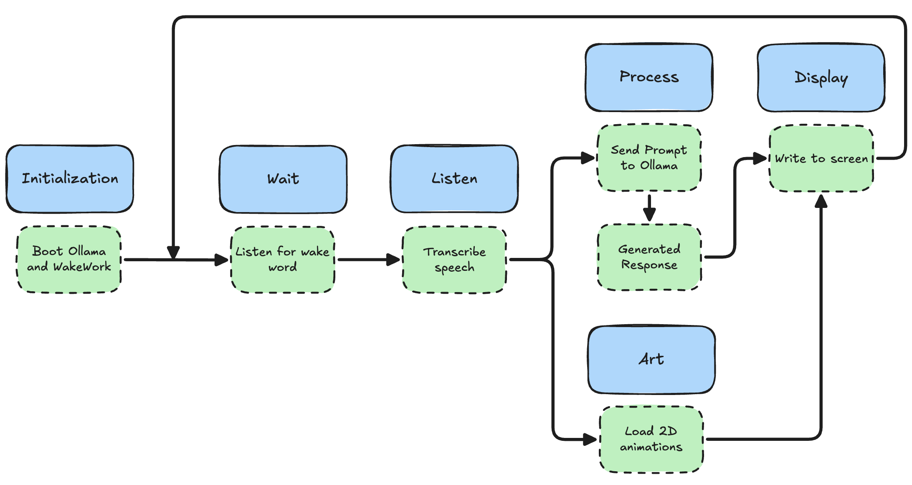

# Retro PC AI Assistant

## An AI assistant built for the NVIDIA Jetson Orin Nano using an Ollama model.

A retro-inspired, fully on-device AI voice assistant built on the NVIDIA Jetson Orin Nano. Housed in a wood-textured 3D-printed enclosure, it listens for one of the following wake words:

* "Alexa"
* "Hey Mycroft"
* "Hey Jarvis"
* "Hey Rhasspy"
* "What's the weather"
* "Set a 10 minute timer"

Afterwards, it processes your vocal query locally: speech is transcribed on-device by Whisper, the text is passed to the llama3.2:3b model via Ollama to generate a reply, and the response is spoken aloud with Piper while being typed out on the display before returning to an idle animation.

## Model System Architecture

<picture>
  <source media="(prefers-color-scheme: dark)" srcset="assets/architectureDark.png">
  <source media="(prefers-color-scheme: light)" srcset="assets/architectureLight.png">
  
</picture>

# Installation and Quickstart Guide

## Prerequisites

- Micro sd card with _Jetson Orin Nano Developer Kit on JetPack 6.x_ download
- A USB microphone
- Git LFS

```bash
sudo apt install git-lfs
```

- Ollama

```bash
curl -fsSL https://ollama.com/install.sh | sh
ollama pull llama3.2:3b
```

## 1. Clone the Repository

```bash
git clone https://github.com/zms39/jetson-assistant.git
cd jetson-assistant

# Download the Piper voice model (~63 MB)
git lfs install
git lfs pull
```

## 2. Set Up the Python Environment

```bash
sudo apt install python3.10-venv portaudio19-dev libportaudio2
python3 -m venv venv
source venv/bin/activate

# Install libraries
pip install "numpy==1.26.4" faster-whisper openwakeword sounddevice scipy requests pygame piper-tts
```

NumPy is pinned below 2.0 for compatibility with `tflite_runtime`, which openWakeWord uses.

## 3. Run the Program

From the project root with the venv active:

```bash
python main.py
```

`main.py` waits for Ollama, loads the Whisper and wake word models, then enters idle mode. Press `ESC` to exit to the desktop, `A` to toggle dot matrix art mode, and `N` to cycle animations.